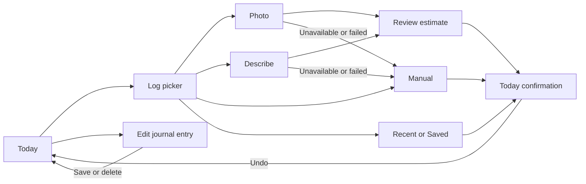

# Core meal loop: state sheet and preservation contracts

October 8, 2026 · Source inspection baseline: `923f2e4e` · M2 implementation companion

This sheet describes the meal journey and preservation contracts for its first UI enhancement slice. It supports [E2E-PLAN.md](E2E-PLAN.md) and journeys J03–J07, J15 and J16 in [E2E-CHECKLIST.md](E2E-CHECKLIST.md). Actual implementation outcomes are recorded in [implementation evidence](core-meal/README.md); the source and test selection here remain a contract inventory.

## Journey and destinations

| Entry | Existing destination rule | UI contract |
|---|---|---|
| Today meal-group Add button | Carries that group's `mealType` into `/log`, then the chosen method | Show the same destination in the picker and final confirmation. |
| Global Log action or direct `/log` | Uses the current default meal slot; entries are dated now | Keep Today explicit even when the underlying page is an archived journal. |
| `/log/photo` or `/log/text` | Captures the requested slot once; forwards it to `/review` and Manual fallback | Failure, cancel and fallback retain this slot. No entry is created by estimating. |
| Direct `/review` | Pending in-memory estimate, otherwise an account-scoped review draft | Show restoring or a useful Choose a logging method recovery; never display an invented meal. |
| Direct `/log/manual` | Requested slot wins, then restored draft slot, then default | Preserve entered fields and portion until accepted or explicitly cleared. |
| `/edit/:id` | Existing entry's slot and original timestamp | Save affects this journal entry; its date remains unchanged. |

In production these app routes run under `/app/`. Normal route changes scroll to the top and focus the page heading. Opening a picker with a background route preserves underlying scroll; closing it returns to that same scroll position.

## Today and picker states

| State | What is shown / available | Retained information | Focus and exit |
|---|---|---|---|
| Active, populated Today | Date, daily totals, all three macros, meal groups, Log action, chosen-step progress, optional Momo greeting | Journal entries, selected date, profile targets and preferences | Heading receives route focus. An entry opens Edit; group Add opens the picker with its slot. |
| Active, empty Today | A useful first-log invitation and light Add rows | Real zero-entry journal; no fake sample values | Main Log action and first Add row are reachable. The standard 390×844 fixture should show totals and Log together. |
| Tracking paused | Pause notice; the Today journal, calorie/macros and ring are hidden. Navigation still supports logging. | Pause state and existing journal | Manage pause opens You. Accepted logging gets quiet feedback under the existing rules. |
| Archived day | Correct date and that day's entries; return-to-Today action | Selected date and real historical totals | Empty historical groups have no Add rows; a new global log still targets Today. |
| Guest journal | Claim/save-progress surface and existing first meal | Guest journal and current outfit | Account handoff remains available; guest-only route restrictions stay intact. |
| Picker arrival | Destination header; Photo, Describe, Manual and Saved methods; search; at most three initial compact recents | Underlying route/scroll and selected slot | Dialog focus enters a control without focusing search or opening the keyboard. Close, backdrop and Escape use the existing close path. |
| Destination expanded | Five meal-slot choices with current choice announced | Search, shelf and current repeat portion | Selecting a slot closes the choice group and updates every method/repeat destination. |
| Recent/Saved shelf | Relevant rows with explicit Log and portion control; Show more for recents | Distinct meal identity, nutrition, baseline portion and selected slot | Default recent repeat is two taps from Today: open Log, then Log the row. Portion changes require a deliberate extra action. |
| Search match / no match | Matching unique foods or useful empty result; methods remain discoverable | Search query and destination | Clear search returns to the shelf. Typing a number offers a clearly labelled calories-only quick add. |
| Portion dialog | Baseline, selected multiplier, calculated calories and destination | Parent picker state and meal selected for the dialog | Closing the child returns to the picker; no accidental parent close or meal commit. |

The top-of-page enhancement must keep the neutral greeting independent of nutrition values. The chosen-step ring measures logging habits through `mealType`, `source` and `detailAdded`; it never consumes calories or macro amounts. Its accessible SVG reports “N of N chosen steps complete,” and its legend distinguishes required and optional steps. Collapsing detail may change presentation while keeping that information available to keyboard and assistive-technology users.

## Capture, estimation and recovery

| State | What is shown / available | Retained information | Focus and exit |
|---|---|---|---|
| Describe, ready | Labelled multiline description, optional examples, Estimate action and Manual path | Account-scoped text draft; selected slot in route state | Route heading is focused. Examples fill a draft and do not submit. Start fresh clears text only and focuses the description. |
| Photo, empty | Camera/gallery choice, file limit, privacy disclosure and Manual path | Current slot; no upload on selection | Choosing or cancelling the native picker leaves a usable screen. Photo privacy explains that Analyze is the send action. |
| Photo selected | Preview, filename, Remove/Replace and Analyze | File is retained in the device draft store | Selection stays local. Remove clears the photo draft; Replace validates the replacement before adopting it. |
| Invalid photo | Specific readable error and useful existing input/action | Any prior valid selection stays recoverable | Error feedback receives focus; unsupported/oversize input creates no request or meal. |
| Estimating | Honest indeterminate status and Cancel analysis | Description or selected photo; selected slot | Cancel receives focus on entry to the working state. Repeated activation cannot create parallel requests. |
| Cancelled | “Analysis stopped” status, original input and Estimate/Analyze action | Recoverable input and destination | Retry starts a new request. A late result from the cancelled request cannot navigate to Review. |
| Failed request or malformed result | Safe error, Retry and Manual fallback | Input remains on screen and in its draft | Failure creates no journal entry. Manual fallback carries the slot; the independent text/photo draft remains recoverable. |
| AI checking / unavailable / limit reached | Known availability reason with applicable Check again, AI setup or Manual action | Existing usable input | No fake progress or successful connection label. Choosing a method is never a credential probe. |
| Successful estimate | Review receives source, estimate and slot; current photo may appear as evidence | Review becomes the recoverable draft; originating text/photo draft is cleared | Normal route heading focus. This is still an unsaved estimate. |
| Restored capture draft | Unfinished meal notice with Continue / Start fresh | Text or durable photo file scoped to the account | Continue focuses the relevant composer/photo action. Start fresh clears only that capture form. |

Photo evidence on Review exists only in memory for the current review. A full reload restores nutrition but does not promise to restore that evidence image. The durable photo draft is cleared after a successful estimate. Preserve this distinction in copy and screenshots.

## Review, correction and accepted logging

| State | What is shown / available | Retained information | Focus and exit |
|---|---|---|---|
| Valid review | Name, portion, four nutrition fields, slot, final totals and Log meal | Review analysis, scaling base, portion, source and slot | Desktop summary stays beside the editor. Phone confirmation strip exposes final calories/portion and Log meal with reserved layout space. |
| Adjusted nutrition | Adjusted marker and an individual Reset action where a true original estimate is available | Other corrected values, name, slot and selected portion | Reset affects only the intended field and returns it to the original model value scaled to the current portion. |
| Portion changed | Final totals and grams reflect the normalized multiplier | Stable per-serving base; names and chosen slot | Multiply the stable base once. Switching 1× → 1.5× → 1× cannot accumulate rounding errors. |
| Invalid or blank required field | Specific error and a useful incomplete-total hint | Raw blank state, other edits and destination | Submit focuses the first invalid field. The field and error remain reachable above the phone keyboard. Guard resets after rejection so correction can be submitted. |
| Restored review | Current edits, portion and destination, plus Unfinished meal notice | Account-scoped review draft | Continue focuses Food name. Start fresh clears review and returns to the picker without clearing unrelated drafts. |
| Missing/expired review | Restoring status, then explanation and Choose a logging method | No usable estimate is fabricated | Action returns to picker with valid route context. |
| Start over / discard | Existing confirmation before discarding a usable estimate | Draft is retained if confirmation is cancelled | Confirm clears review, pending analysis and in-memory photo evidence, then opens picker carrying the current slot. |
| Accepted log | Exactly one entry, fresh-row highlight and either the existing confirmation card or toast | Saved nutrition exactly matches displayed final values; review draft is cleared | Return to Today; confirmation does not take focus. Undo removes only the accepted entry. |

### Calculation and persistence details to preserve

- Review nutrition fields represent the **current total**. Manual nutrition fields represent **one serving**. Shared UI must keep these labels and calculations distinct.
- `normalizeServings` currently rounds to quarter portions and clamps to 0.25–1,000. Existing range/validation rules stay in the calculation layer.
- Review portion scaling rounds calories and grams to integers and macros to one decimal. Directly entered macro corrections are saved as entered; repeating Saved/recent meals uses its existing repeat rounding. Displayed and persisted values must agree with the applicable path.
- Existing Review `baseRef` is a stable scaling base for the current corrections. A numeric correction writes `value / servings` into that base. It is **not** an immutable original model estimate after editing.
- Per-field reset therefore needs a separately retained original estimate. Existing restored drafts with no original estimate must stay usable, and must not claim an edited base is the original. The draft validator uses an exact field allowlist; new optional original-estimate data needs backward compatible parsing and serialization.
- Manual numeric changes invalidate the ingredient breakdown. Portion changes must not restore a stale original breakdown after a correction. Resetting one field must not imply that all ingredient estimates are trustworthy again.
- Blank Review numeric fields are tracked separately from numeric zero and must survive reload. Manual macros are optional; blank optional macros follow existing validation semantics.
- Drafts are account-scoped with a seven-day TTL. Late hydration must respect newer edits and explicit clears. Keep the existing pending-writer and clear-generation protections when changing field components.
- A fixed phone submit control and an in-page desktop submit must share the same form/save guard. Hidden variants must not leave duplicate focusable or accessible controls. Repeated activation creates one entry and one confirmation.

## Confirmation, Undo and edit states

| State | Existing behaviour to retain |
|---|---|
| Ordinary second/later log | One readable toast with Undo; the resulting meal is immediately visible. |
| First meal, wardrobe, milestone or chosen-step closure | Existing feedback planner selects a finite confirmation card and capped motion; it does not queue extra dialogs or awards. |
| Card hover / keyboard focus | Ten-second dismissal timer pauses while interacting; Undo and Dismiss remain stable targets. |
| Card exit while focused | Focus moves to the Meals heading before unmount. Dismissal does not jump the page or move the last row. |
| Refresh after confirmation | Accepted meal persists, confirmation is not replayed, and the ring check is not acknowledged twice. |
| Paused / calm / reduced motion / hidden Momo | Existing preferences govern decoration and feedback; all task text and Undo remain available. |
| Edit existing entry | Original entry stays unchanged until Save changes. Invalid edits do not save. Cancel/leave retains the existing unsaved-change confirmation. |
| Save as favourite | Independent template is toggled through the existing action; changing/deleting a journal entry does not silently rewrite the template. |
| Delete → Undo | Explicit deletion path removes the intended entry; short Undo restores the same entry, including its date and source. |
| Missing edited entry | Useful Back to Today recovery; no blank editable meal is fabricated. |

Today deliberately retains confirmation-card clearance until it unmounts. That geometry is held through other Today state updates, including water/note changes. Preserve it during compaction; removing a card at the scroll end must not force the page upward. The once-per-local-day ring acknowledgement also survives delete/relog, refresh and browser Back/Forward.

## Verification selection for this slice

Use deterministic mock estimates and synthetic account fixtures. Record actual outcomes separately from this inventory. Run the focused set after integration; broaden only where changes or a failure warrant it.

| Evidence | Existing coverage / meaningful addition | Why it matters here |
|---|---|---|
| Today hierarchy | `ui-ux-improvements.spec.ts`, relevant `day-ring.spec.ts`; add a geometry check for summary + Log and first meal/Add at 390×844 | Compaction must measurably improve access while keeping archive/paused states and habit semantics. |
| Picker discovery / repeat | `repeat-meal-context.spec.ts`, `log-activation.spec.ts`; add method visibility before scrolling, three-recents/Show more, no input focus on arrival and two-tap default repeat | New order and compact rows can obscure controls or context. |
| Capture → Review → log | `meal-flow.spec.ts` | Covers mocked text/photo, cancellation and late result, failure/retry, draft reload, selected slot, invalid focus and Undo. |
| Per-field reset | Focused pure calculation/draft compatibility tests plus one browser journey: 1.5× → edit calories and protein → Reset calories → reload → Log | Proves immutable baseline, independent corrections, current-portion reset and accepted persistence rather than appearance alone. |
| Review keyboard / strip | Focused short-viewport and touch journey, light/dark; validate focused field, error and submit hit area remain reachable | Existing `mobile-ux.spec.ts` keyboard checks cover Manual/Coach, so Review needs targeted coverage. Desktop emulation does not certify a native software keyboard. |
| Edit / Saved independence | `release-flow.spec.ts` at desktop, phone and tablet; `swipe-row.spec.ts` where touched | Shared Review styles/fields also affect Edit, including Save, delete and Undo. |
| Confirmation geometry | Affected `log-moment.spec.ts` cases | Protects focus, single feedback, refresh suppression, scroll-end clearance and reduced-motion behaviour. |
| Shared accessibility/layout | Relevant `tap-targets.spec.ts`, `ui-obstacles.spec.ts`, light/dark screenshots and canonical affected visual cases | Maintains named 44px controls, no horizontal overflow, stable bottom chrome and intentional visual changes. |
| Production routes | Affected `production.spec.ts` paths | The `/app/` basename must retain working Review/log assets and direct navigation. |

At minimum inspect 390×844 phone and 1440×900 desktop, plus a narrow 320px and short keyboard-height Review. The implemented order places budget/macros and Meals before the companion on phones; desktop keeps the companion beside Meals. `day-ring.spec.ts` now asserts that intentional structure while retaining the semantic progress assertions. Compact picker rows consolidate visible destination into the shared header; each row retains its accessible destination description and exact Log name, with persisted-slot coverage.

Physical iOS/Android camera, software keyboard, browser chrome and safe-area behaviour remain separate device evidence. Local mocked journeys also do not establish real cloud sync durability or upstream provider availability.

### Source anchors

`HomePage.tsx`, `LogSheet.tsx`, `PhotoLogPage.tsx`, `LogTextPage.tsx`, `ManualEntryPage.tsx`, `ReviewFoodPage.tsx`, `EditFoodPage.tsx`; `DayRing.tsx`, `TodayMomo.tsx`, `LogMoment.tsx`, `LogFlowUI.tsx`, `MealEntryFields.tsx`, `Sheet.tsx`; `logContext.ts`, `mealReview.ts`, `logDrafts.ts`, `pendingDraftWriter.ts`, `logFeedbackPlan.ts`, `logPresentation.ts`, `dayRingEntries.ts`; route/focus behaviour in `App.tsx`.
