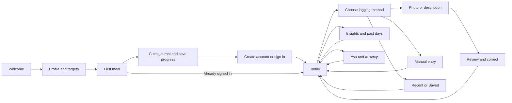

# Poiem: end-to-end UI enhancement plan

October 8, 2026 · Web app on desktop and phone · Planning baseline: `923f2e4e`

The outcome is a complete, playful journey: understand Poiem, get started, log a meal, check it, return to the journal and repeat the routine comfortably. Every redesigned screen must carry the user's context into the next screen and provide a useful recovery when something fails.

This is the active plan. [E2E-CHECKLIST.md](E2E-CHECKLIST.md) defines the observable checks. Recommendations come from current source, existing browser suites and saved screenshots. Controlled local performance is recorded in the recovery report; the response-time budget is not met. Participant usability targets and field performance remain unmeasured.

**Current delivery:** The M2 core meal slice, local M3 first-session/account slice, M4 everyday-use controls and M5 local recovery changes are built. [Core meal evidence](core-meal/README.md), [first-session evidence](first-session/README.md), [everyday-use evidence](ongoing-use/README.md) and [recovery evidence](recovery/README.md) record their scope and checks. The [recovery gallery](recovery/gallery.html) compares Settings departure, backup review, help, Saved controls and sync presentation; [Momo storyboards](first-session/momo/gallery.html) show three finite scenes. Final local integration/performance results are recorded in the recovery report. Full M0/M1 participant evidence, field performance, physical phones, other browser engines and cloud staging remain release gates; local implementation does not close them.

**1. The experience we are building**

The visual direction is a playful Neo Brutalist kitchen journal. Keep warm paper, strong ink, bright meal colours, condensed headings and tactile controls. Give Today a clear hierarchy, make logging methods immediately discoverable and let Momo perform short comic scenes during quiet moments.

Use three levels of emphasis: one main feature panel, clear section labels and compact reading rows. Apply the strongest colour and shadow to the current action. Keep type, spacing, icon scale and colour meanings consistent across light and dark themes. Desktop should use its space for useful side-by-side content; phone should keep the next action within reach.

The existing scene renderer, design tokens, repeat logging, portions, Undo, draft recovery and custom API support are the starting components. Their behaviour becomes part of the acceptance contract.

Guests currently complete their first meal manually before claiming their progress. Signed-in first-time users can also use an eligible AI method. Retain the adult eligibility, profile validation and real-first-meal activation rules. Returning members can sign in directly. Any proposal to remove the first-meal gate is a separate product decision.

**2. Redesign complete journeys**

| Journey | Concrete changes | Completion condition |
|---|---|---|
| Arrive and understand | Welcome shows what a complete meal log looks like, one clear start action and a visible returning-member path. Keep the public and app entry points consistent. | A new visitor can explain the next action and reach setup; a returning member reaches sign-in directly. |
| Set up and log the first meal | Show current section and remaining steps; keep Back and resume behaviour predictable. Explain AI account requirements beside the relevant choice. Preserve entered profile and meal data through the account handoff. | Refresh resumes the same step. Valid completion creates one first meal and one confirmation. Guest claim carries the intended journal into the correct account without duplicate meals. |
| Open Today and act | Compact the greeting and day-progress panels. Put daily totals and a clear Log action near the top. Use light add rows for empty meal groups. Keep the desktop summary beside meals. | At 390×844, summary and logging action are visible together, with the first meal/add row starting in the usable first viewport of the standard fixture. |
| Choose how to log | Move Photo, Describe and Manual above the recent list; retain Saved access. Show three compact recent rows and Show more. Put meal destination in one clear header. | All methods are discoverable without scrolling at 390×844; a normal repeat takes two taps from Today. Opening the sheet does not summon the keyboard. |
| Capture and estimate | Give camera/gallery selection, photo preview, typed description, estimating, cancel, retry and manual fallback a consistent layout and language. Use truthful status text. | A failure preserves the usable input. Cancel stops the active request. Retry creates one estimate. Recovery retains the selected meal destination. |
| Review and correct | Keep portion and final totals near the primary action. Add a keyboard-aware phone confirmation strip, final macros in the desktop summary and Adjusted/reset controls for individual values. | The displayed final values are the values saved. Reset affects only its intended correction. Invalid fields receive focus and stay visible. |
| Manage and repeat meals | Use compact Saved rows on phone and a denser desktop layout. Add Recently used, Name and Most used sorting. Keep portions, save state and explicit Log actions easy to reach. | Search, filtering and sorting identify the intended meal; a repeat uses the chosen portion and destination. Editing or deleting a journal entry does not silently alter its Saved template. |
| Understand the routine | Add a concise factual weekly summary, clearer grouping of trends and Journey, and a selectable chart-day inspector with Open this day. | Periods and data sources are clear. Chart selection opens the matching date. Unlogged days remain distinct from zero intake. |
| Ask Coach | Use an expanding multiline composer. Starter prompts populate an editable draft. Add Copy response and restrained follow-up actions. Keep status and recovery close to the message. | A starter does not send automatically. Cancel/retry does not duplicate messages or revive a discarded response. Drafting remains usable above the phone keyboard. |
| Adjust preferences and AI | Search lands on the exact field, opens its disclosure and highlights it briefly. Show precise save state. Add Stay, Discard and Save where valid when leaving with pending profile/AI changes. | Immediate preferences remain applied; unrelated drafts stay pending. An invalid cross-panel save opens and focuses its error. API setup distinguishes saved configuration from a verified connection. |
| Recover account or data | Give password recovery, session expiry, offline work, sync conflicts, import and destructive actions a clear destination and consequence. Preview a backup before replacement. | Data stays recoverable, the selected account is clear and cancellation makes no replacement. Reauthentication can resume the eligible task without sharing drafts across accounts. |

Use explicit destination text wherever the current logging rules target Today. Viewing an archived day must never make a new entry's destination ambiguous. Back, close, reload and direct links belong to each journey's design, including `/app/` production routes.

**3. Momo and action feedback across the journey**

| Moment | Proposed treatment | Behaviour contract |
|---|---|---|
| A meal is accepted | A short paper-stamp treatment on the existing confirmation; highlight the arriving meal | One confirmation, working Undo and a stable tap area. |
| A quiet moment after a task | Momo folds a decorative journal ticket into a paper plane | Reuse the existing visit caps and scheduler; defer during typing, dialogs and Undo. |
| Browsing Today or Insights | Momo peeks around a heading and polishes its decorative underline | Use a decorative copy; real labels, values and focus stay stable. |
| Browsing Saved | Momo balances the public Saved star on a tray | A short local joke, one scene at a time, clear Close/Mute controls. |
| Water, save and navigation | Extend the existing drops, star pop and selected-navigation feedback with coherent timing | Feedback starts with the action; decorative motion finishes and cleans up. |

Momo is a freestanding character with props and a separate speech bubble. Use public labels and local dialogue for these scenes. Keep body, food amounts and private text outside the joke material. Calm, mute, Show Momo and reduced motion must govern every new scene. Forms and error recovery get the user's attention first. New scene code loads after the useful screen.

**4. Design every important state before implementation**

For each affected screen, produce its populated and empty state plus relevant loading, invalid, unavailable, success and recovery states. The state sheet must say what the user sees, what action is available, what is retained and where focus goes.

| State | Required experience |
|---|---|
| First visit / empty journal | One useful start action, a small illustration and a clear explanation of what will appear after logging. |
| Working / estimating | Honest indeterminate feedback, stable layout and cancellation where supported. |
| Validation error | Specific field message, retained input and visible focus on the first relevant error. |
| AI unavailable / limit reached | Explain the known reason and offer the applicable setup, retry or manual path. |
| Offline with a valid device copy | Say what is saved on the device and what still needs syncing; keep supported local work available. |
| Account copy unavailable / storage recovery | Explain why an action is blocked and how to recover a usable copy. |
| Sync conflict | Show available device/account summaries, require the existing backup step and clearly identify which copy each choice will replace. Fetch or label unavailable comparison data accurately. |
| Unsaved profile / AI draft | Preserve it across Settings panels. Protect departure from Settings; use a native unload prompt where supported. Keep unsaved keys in memory and require re-entry after a full reload. |
| Backup import | Parse and validate first; preview meal counts, date range and replacement scope. Cancel has no effect. Confirm applies the reviewed snapshot. |
| Saved / removed | Show one confirmation and Undo where supported; keep the resulting state correct after reload. |
| Session expired | Offer sign-in and resume the eligible task for the same account. Scope resume information to allowed app routes and the account; intentional sign-out clears task resumption. |

A return target or draft reference may be retained for navigation. Passwords, API keys and meal contents must not be placed in return URLs. Provider errors displayed by the UI must stay safe and readable.

**5. Desktop and phone contracts**

| Surface | Layout and interaction |
|---|---|
| 320–430px phone | Single column, compact headers, bottom navigation, 44px app controls and comfortably sized primary actions. Reserve space for fixed bars. |
| Phone keyboard open | Focused field, its error and the relevant submit/continue action remain reachable. Resolve overlap between keyboard, confirmation strip, navigation, toast and Momo. |
| 768px tablet | Use two columns only where the contents remain readable; otherwise keep a comfortable single column. |
| 1120px+ desktop | Side navigation, summary/detail layouts for Today and Review, readable text widths and visible hover/focus actions. |
| Landscape / short window | Compact chrome, scrollable sheets and no inaccessible footer actions. |
| Zoom / large text / keyboard | Content reflows; controls keep accessible names; focus order follows the task. Chart inspection also has keyboard and textual access. |

Reserve the existing dedicated room for Momo only when it benefits the layout. Apply light/dark and reduced-motion variants to shared components before copying a pattern to every screen. The 44px control rule is Poiem's product target; see [W3C target-size guidance](https://www.w3.org/WAI/WCAG22/Understanding/target-size-minimum.html) and [interaction-motion guidance](https://www.w3.org/WAI/WCAG22/Understanding/animation-from-interactions.html).

**6. Delivery sequence and dependencies**

Each milestone produces a runnable journey, screenshots of relevant states and the applicable evidence from the checklist. Shared layout/component changes have one integration owner so parallel screen work does not create competing styles.

| Milestone | Work | Concrete deliverable | Gate before the next dependent milestone |
|---|---|---|---|
| M0 · Baseline and journey specification | Inventory routes, states, existing behaviour and current performance. Record friction in first session, daily logging and returning use. | Route/state inventory, before screenshots, baseline task results, shared spacing/type/motion specification | Every customer route has a primary action, entry, exit and recovery. Proposed metrics have a recorded baseline or are explicitly unmeasured. |
| M1 · Complete concept prototype | Prototype Today → log method → review → confirmation → Undo/repeat, plus welcome/setup/account handoff. Include error and keyboard states. Storyboard Momo's three scenes. | Clickable phone/desktop concept, final microcopy and reusable component/state sheet | Walk both a first-time and returning-user journey without guessing the next step. Review keyboard and error recovery as part of the prototype. |
| M2 · Core meal loop | Implement Today, log sheet, Photo, Describe, Manual, Review and Edit using the shared patterns. Add compact repeat rows and confirmation feedback. | Working daily meal journey with persistence and recovery | J03–J07 pass; correct meal/portion/date context, working Undo and no duplicated save on rapid activation. |
| M3 · First session and account continuity | Implement onboarding presentation, guest claim, sign-in/reset handoffs, resume handling and clear account context. | Working welcome → first meal → account → returning visit journey | J01–J02 pass locally and applicable account checks pass in cloud staging; account changes cannot mix drafts or data. |
| M4 · Ongoing use and character | Implement Saved sorting, Insights day inspection, Coach drafting/reuse, exact Settings search and Momo scenes. | Working browse → repeat → reflect → adjust routine journey | J08–J11 pass along with Momo interference checks. Data summaries use real values and named periods. |
| M5 · Recovery and release | Finish Settings exit handling, import preview, sync recovery, Support/About consistency and performance work. Run integrated evidence on the release candidate. | Before/after gallery, complete checklist, device notes, performance comparison and rollback reference | J12–J16 pass where applicable. Remaining external-device or staging checks are visibly pending; they cannot be reported as completed. |

M0 → M1 → M2 is the first delivery chain. After shared contracts settle, M3 and the independent M4 screen work can proceed in parallel. M5 integrates their final result. Refine calendar estimates after the M1 prototype and baseline expose the actual work; completion is defined by the gates above.

**7. Scope and dependencies**

Presentation changes use `web/app` and the existing design system. Keep nutrition calculations, eligibility, quotas, role checks and sync authority in their existing logic. Changes to those rules need a separately stated product requirement.

Resume navigation, per-field correction reset, Settings exit guards, import previews and sync comparison are stateful work. Implement them with explicit data-retention rules and focused behavioural checks. Reuse existing persistence and account APIs; record a dependency if a proposed comparison requires data the current API does not return.

Custom API choice continues to use supported OpenAI-compatible, Gemini and Anthropic formats, plus compatible gateways. The end user sees Poiem AI as the default. Operator credentials remain on the server and personal credentials retain their existing connection binding. The prepared managed-model migration is a separate deployment item recorded in the existing rollout guide.

Admin and the component catalogue receive shared-style and access regression checks. Customer workflow enhancements are the priority of this plan. The Expo application is outside this web delivery.

**8. Measure whether the experience improved**

| Goal | How to judge it |
|---|---|
| Discover logging | In a small task-based review, first-time participants find Photo, Describe and Manual without assistance. Record where they hesitate. |
| Repeat quickly | With a visible recent meal and the current default portion/destination, open Log and repeat in two taps from Today. |
| Understand confirmation | Participants can name the final portion, calories and destination before saving; saved data matches the screen. |
| Keep context | Refresh, Back, cancellation, an AI failure and same-account sign-in preserve the defined draft/context, without creating entries. |
| Enjoy Momo | Participants can notice, dismiss and mute a scene while still completing the current task. Record interruptions and missed taps. |
| Load and respond well | Compare the same routes on the same device/network profile. Keep initial downloaded JS/CSS from growing unless a documented tradeoff is accepted; lazy-load new scene assets. |

For field monitoring, target LCP ≤2.5s, INP ≤200ms and CLS ≤0.1 at the 75th percentile, measured separately on mobile and desktop. Before release, record comparable lab traces and interaction measurements; a Lighthouse load score alone does not establish INP or field performance. These targets and the lab/field distinction follow [Web Vitals guidance](https://web.dev/articles/vitals).

Task-review observations are qualitative until there is enough usage data for a stronger conclusion. Use anonymous event names and durations for any agreed measurement; avoid collecting meal text, photos or credentials for UI analytics.

**9. Definition of done**

The final release candidate completes the checklist's critical journeys, including their failures and recovery, on the required desktop and phone coverage. Main actions remain visible and reachable; data survives the defined transitions; Momo and motion preferences behave consistently; deliberate screenshot changes have been reviewed; and the performance comparison is recorded.

The review package contains the final commit, build/environment, before/after screenshots, short interaction captures, completed journey results, known limitations and the previous deployable revision. Local mocked results, cloud staging results and real-device results are reported separately. Rollout uses the normal deployment process, followed by a production route/asset smoke check and an initial check of errors and meal-log completion. A severe navigation, persistence or credential issue triggers rollback to the recorded revision.

The next delivery step is to complete the recorded release checks: compare the local performance evidence with its budgets, exercise the applicable workflows in cloud staging, and review physical phones, other browser engines and participant task results. Local recovery now protects Settings departure, previews validated imports, keeps sync actions in page flow and provides direct help destinations. Preserve the account, draft, calculation and character-interference contracts in the state sheets while completing those checks. No rollout is included in this local implementation.
